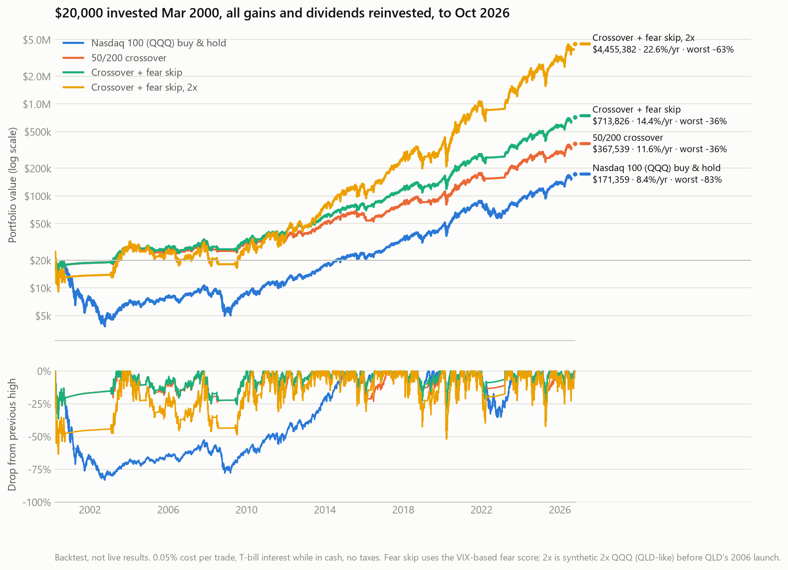
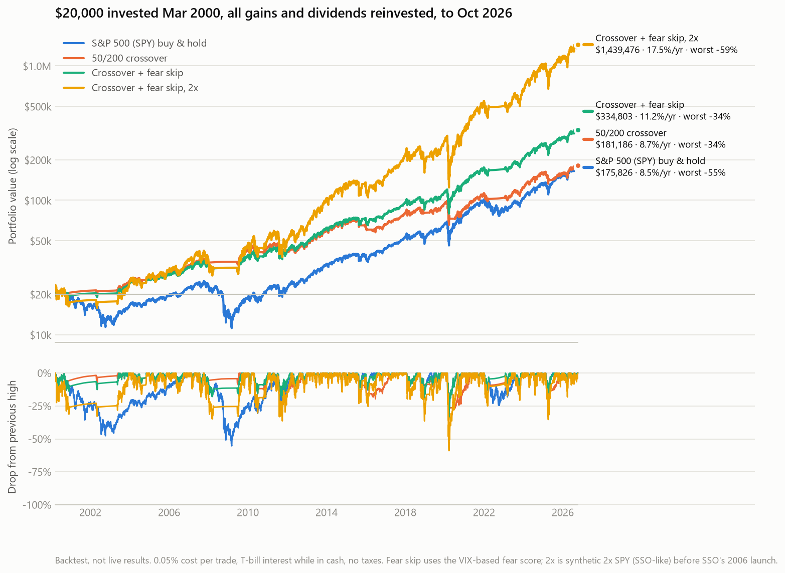
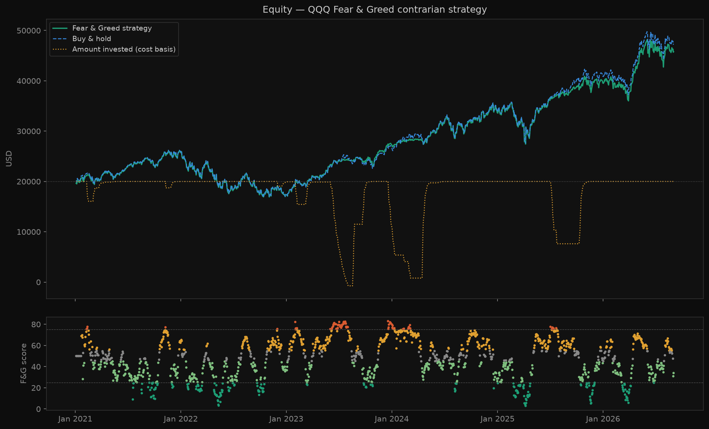

# Paper Trader

A personal research sandbox for testing trading strategies with paper money
and historical backtests. No real money is involved.

There are two independent strategy families in this repo:

| Family | Folder | Idea |
|--------|--------|------|
| **Index trend & sentiment** *(latest work)* | [`index_strategies/`](index_strategies/) | Hold an index ETF (QQQ / SPY) while the 50-day SMA is above the 200-day SMA. Use the CNN Fear & Greed Index to skip death-cross exits that happen during panics. |
| **Informed-trading signals** | [`informed_trading/`](informed_trading/) | Look for unusual volume, order-flow imbalance and gaps across 25 US large caps, then paper-trade long/short swing positions. |

---

## Repository layout

```
.
├── README.md
├── requirements.txt
├── docs/
│   ├── AWS_SETUP.md                  # hosting the paper trader on EC2 with cron
│   └── images/                       # backtest charts used in this README
│
├── index_strategies/                 # ── Index trend & sentiment (current focus)
│   ├── sma_crossover_backtest.py     # 50/200 SMA golden/death-cross backtest
│   ├── fear_greed.py                 # CNN Fear & Greed Index fetcher + local cache
│   ├── fear_greed_backtest.py        # contrarian Fear & Greed allocation backtest
│   └── assistant_instructions/       # prompts that run the live daily signal
│       ├── 1_nasdaq_assistant.txt    #   computes and reports the QQQ signal
│       └── 2_developments_assistant.txt  # news assistant: flags rule-relevant events
│
└── informed_trading/                 # ── Signal-based long/short swing trader
    ├── paper_trader_1.py             # live two-phase paper trader (current)
    ├── backtest_6.py                 # latest daily-bar long/short backtest
    ├── backtest_7.py                 # backtest_6 + Alpaca 5-min bars for intraday stops
    ├── monte_carlo_optimiser.py      # walk-forward parameter optimiser
    ├── report.py                     # P&L / open-position viewer
    ├── dashboard.py                  # Flask web dashboard for the EC2 deployment
    ├── tools/
    │   ├── signal_path_analysis.py   # average 5-min price path after each signal type
    │   └── alpaca_test.py            # Alpaca API connectivity check
    └── archive/                      # earlier versions kept for reference
        ├── paper_trader.py           #   v1 paper trader
        ├── backtest.py               #   first long/short backtest
        ├── backtest_4.py
        └── backtest_5.py
```

Each script writes its output to a `data/` folder next to itself, for example
`index_strategies/data/`. Those folders are git-ignored because the scripts
can regenerate everything in them.

---

## Setup

```bash
python -m venv .venv
.venv\Scripts\activate          # Windows  (source .venv/bin/activate on macOS/Linux)
pip install -r requirements.txt
```

### Secrets

The repo contains **no credentials**. Everything is read from environment variables:

| Variable | Used by | Purpose |
|----------|---------|---------|
| `ALPACA_API_KEY`, `ALPACA_API_SECRET` | `backtest_7.py`, `tools/` | Alpaca market-data API (free paper account) |
| `NOTIFY_FROM`, `NOTIFY_PASSWORD`, `NOTIFY_TO` | `paper_trader_1.py` | Gmail App Password for run-summary emails |

```powershell
# Windows (persistent, user scope)
[System.Environment]::SetEnvironmentVariable("ALPACA_API_KEY",    "<your key>",    "User")
[System.Environment]::SetEnvironmentVariable("ALPACA_API_SECRET", "<your secret>", "User")
```

---

# Part 1 — Index trend & sentiment strategies

This is the current direction of the project. It trades a single index ETF
using a long-term trend filter, with market sentiment used to handle the
filter's weakest moments.



| Nasdaq 100, $20k from Mar 2000 to Oct 2026 | Final value | CAGR | Worst drawdown |
|---|---|---|---|
| QQQ buy & hold | $171k | 8.4% | −83% |
| 50/200 SMA crossover | $368k | 11.6% | −36% |
| **Crossover + fear skip** | **$714k** | **14.4%** | **−36%** |
| Crossover + fear skip, 2x (QLD-like) | $4.46M | 22.6% | −63% |

| S&P 500, $20k from Mar 2000 to Oct 2026 | Final value | CAGR | Worst drawdown |
|---|---|---|---|
| SPY buy & hold | $176k | 8.5% | −55% |
| 50/200 SMA crossover | $181k | 8.7% | −34% |
| **Crossover + fear skip** | **$335k** | **11.2%** | **−34%** |
| Crossover + fear skip, 2x (SSO-like) | $1.44M | 17.5% | −59% |

<details>
<summary>S&P 500 chart</summary>


</details>

*These are backtests, not live results. They assume a 0.05% cost per trade,
T-bill interest while in cash, and no taxes. Fear & Greed history only goes back
to 2021, so the long-horizon "fear skip" runs use a VIX-based fear score in its
place (see the fallback below). The 2x line uses a synthetic 2x ETF before
QLD/SSO launched in 2006.*

## 1.1 SMA crossover: `sma_crossover_backtest.py`

A classic trend-following rule on a single index ETF:

- **Golden cross** (50-day SMA crosses above the 200-day): buy the risk asset.
- **Death cross** (50-day SMA crosses below the 200-day): exit to cash, or rotate into a defensive asset.

The signal is read at each day's close and executed at the next day's open.
The backtest starts out positioned according to the regime on day 0.

Options:

- `--safe-ticker TLT|SHY|BIL|GLD` holds a defensive asset during downtrends instead of cash.
- `--trade-ticker QLD` computes the signal from the unleveraged index but holds a leveraged
  ETF while risk-on. This keeps the leveraged ETF's volatility decay out of the choppy
  periods the trend filter already avoids.

```bash
cd index_strategies
python sma_crossover_backtest.py                              # SPY, full history, cash on death cross
python sma_crossover_backtest.py --ticker QQQ
python sma_crossover_backtest.py --ticker QQQ --safe-ticker TLT
python sma_crossover_backtest.py --ticker QQQ --trade-ticker QLD
python sma_crossover_backtest.py --fast 50 --slow 200 --capital 20000 --start 2015-01-01
python sma_crossover_backtest.py --chart
```

Output: `data/sma_backtest_trades.json` and `data/sma_backtest_summary.csv`.

## 1.2 Fear & Greed Index: `fear_greed.py` and `fear_greed_backtest.py`

`fear_greed.py` downloads the daily **CNN Fear & Greed Index** (0–100) from
CNN's public dataviz endpoint and caches it in `data/fear_greed.json` / `.csv`.
Daily history is only reliable from 2021-01-01 onward.

```bash
python fear_greed.py                    # fetch/refresh the cache and print a summary
python fear_greed.py --start 2022-01-01
```

Inside other code, `load_fear_greed()` returns a date-indexed DataFrame you can join onto price data.

`fear_greed_backtest.py` is a standalone **contrarian** experiment that scales
in and out of one ETF based on CNN's rating buckets:

| Rating | Score | Action |
|--------|-------|--------|
| Extreme fear | < 25 | Buy with 35% of available cash |
| Fear | 25–44 | Buy with 20% of available cash |
| Neutral / Greed | 45–74 | Hold |
| Extreme greed | ≥ 75 | Sell 5% of holdings |

```bash
python fear_greed_backtest.py                       # SPY, daily signal, full cached range
python fear_greed_backtest.py --ticker QQQ --chart
python fear_greed_backtest.py --weekly              # use the weekly-average score instead
python fear_greed_backtest.py --capital 20000 --start-invested 15000
```

**Finding:** used on its own, the contrarian allocation ends close to buy-and-hold
but slightly below it. Trimming in extreme greed costs more upside than buying in
fear makes back. Sentiment worked better as a **filter on the trend rule**,
which led to the combined strategy below.



## 1.3 Combined rule: crossover + fear skip (live signal)

This is the rule currently followed for the Nasdaq 100 (QQQ). It is the plain
50/200 crossover with one exception. A death cross that fires **during extreme
fear** is usually a capitulation low, not the start of a long downtrend, so that
exit is skipped.

```
Uptrend (SMA50 > SMA200)  → INVESTED

Downtrend → find the most recent death cross D
   lowest Fear & Greed over the 10 trading days ending on D:
     ≥ 25  → CASH                     (normal death-cross exit)
     < 25  → death cross is "skipped":
               F&G has closed ≥ 50 on any day since D → CASH   (fear has faded)
               otherwise                              → INVESTED (keep holding)
```

The signal is evaluated at the close and acted on at the next market open. Comparing
today's target with yesterday's gives one of **BUY / SELL / HOLD / STAY IN CASH**.

**VIX fallback** (used when Fear & Greed history is unavailable, and for backtests before 2021):
"Extreme fear" means the VIX close is above the 75th percentile of its last 252 closes.
"Fear faded" means the VIX close is at or below its 252-day median.

Backtests also showed that **selling early when a death cross looks close does not help**.
A narrowing SMA gap is reported for information only.

### Running it daily with AI assistants

The live signal is produced by two AI-assistant prompts in
[`index_strategies/assistant_instructions/`](index_strategies/assistant_instructions/):

1. **`1_nasdaq_assistant.txt`** computes the rule every day from QQQ closes and
   Fear & Greed history. It reports the signal, SMA50/SMA200/gap, F&G, last cross
   and the reasoning, and it outputs `SIGNAL: UNCERTAIN` rather than guess when data is missing.
2. **`2_developments_assistant.txt`** is a news assistant. It never issues signals,
   but it flags events that matter to the rule: the SMA gap within 2%, F&G below 25
   or recovering past 50, or a Nasdaq drop of 3% or more in a day.

---

# Part 2 — Informed-trading signal strategy

The original project. It scores a 25-ticker large-cap watchlist on publicly
observable "informed flow" proxies and paper-trades long and short swing positions.

### Signal detection

| Signal | Description |
|--------|-------------|
| `vol_spike` | Volume > 2× 20-day average |
| `block_trade` | Volume > 1.5× average (large single-print proxy) |
| `cp_ratio_proxy` / `put_ratio_proxy` | Close% × volume ratio above threshold |
| `vpin_bullish` / `vpin_bearish` | 10-day directional volume imbalance ≥ 0.65 |
| `gap_up` / `gap_down` | Open > prior close by 1% |

A composite score (0–1) is the average strength of the signals that fired.
A trade opens when the score is at or above the threshold **and** at least 2 signals fire together.

### Two-phase daily workflow (`paper_trader_1.py`)

```
PHASE 1 — Evening scan  (22:30 Swedish / 16:30 ET, after US close)
  → score all tickers on today's completed candle
  → queue the top N signals (up to free slots) for tomorrow's open

PHASE 2 — Morning open  (15:35 Swedish / 09:35 ET, after US open)
  → fill queued signals at today's actual open
  → check open trades for stop loss / take profit / time exit
  → print portfolio summary and email a run report
```

```bash
cd informed_trading
python paper_trader_1.py --evening        # phase 1
python paper_trader_1.py --morning        # phase 2
python paper_trader_1.py --close-shorts   # same-day short exit (if enabled)
python paper_trader_1.py --status         # portfolio summary
python paper_trader_1.py --schedule       # run both phases on a weekday schedule

python report.py [--open | --signals | --pnl]
python dashboard.py                       # web dashboard on port 5000
```

To host it on AWS EC2 with cron, see [`docs/AWS_SETUP.md`](docs/AWS_SETUP.md).

### Email notifications

1. Turn on 2-Step Verification for your Google account.
2. Create an App Password at `myaccount.google.com/apppasswords`.
3. Set `NOTIFY_FROM`, `NOTIFY_PASSWORD` and `NOTIFY_TO` as environment variables (see [Secrets](#secrets)).

To turn emails off, set `NOTIFY_ENABLED = False` in `paper_trader_1.py`.

### Backtesting

```bash
python backtest_6.py                          # last 30 days, long + short
python backtest_6.py --days 90
python backtest_6.py --long-only | --short-only
python backtest_6.py --start 2024-01-01 --end 2024-12-31
python backtest_6.py --chart | --scores | --scores-chart | --positions

python backtest_7.py --days 1825              # 5 years with Alpaca 5-min intraday stops
python tools/signal_path_analysis.py          # average post-signal price path per signal
```

### Monte Carlo walk-forward optimisation

`monte_carlo_optimiser.py` tunes 11 parameters on 5 separate yearly windows (2020–2024),
averages the best parameters from each year, and tests the result on 2025 out-of-sample.

```bash
python monte_carlo_optimiser.py               # 200 trials/year (~15 min)
python monte_carlo_optimiser.py --trials 50   # quick test
python monte_carlo_optimiser.py --chart
```

| Parameter | Search range |
|-----------|-------------|
| `max_positions` | 5 – 30 |
| `long_score_min` / `short_score_min` | 0.50 – 0.80 / 0.60 – 0.90 |
| `long_min_signals` / `short_min_signals` | 1 – 3 |
| `long_hold_days` / `short_hold_days` | 2 – 6 / 1 – 4 |
| `*_stop_loss_pct` | 3% – 10% |
| `*_take_profit_pct` | 6% – 20% |

Copy the averaged parameters from `data/mc_best_params.json` into
`paper_trader_1.py` and `backtest_6.py`.

### Watchlist

```
NVDA MSFT AAPL AMZN META GOOGL TSLA JPM XOM PFE
MRNA AMD NFLX CRM INTC BAC GS ABBV LLY UNH
V MA AVGO ORCL ADBE
```

---

## Version history

| Stage | Files | Notes |
|-------|-------|-------|
| v1 | `archive/paper_trader.py`, `archive/backtest.py` | Single-phase paper trader, first long/short backtest |
| v2 | `archive/backtest_4.py`, `archive/backtest_5.py` | Backtest iterations |
| v3 | `paper_trader_1.py`, `backtest_6.py`, `monte_carlo_optimiser.py` | Two-phase trader, score segmentation, walk-forward optimiser |
| v4 | `backtest_7.py`, `tools/signal_path_analysis.py` | Alpaca 5-min data and intraday stops |
| v5 | `index_strategies/fear_greed*.py` | CNN Fear & Greed fetcher and contrarian backtest |
| v6 | `index_strategies/sma_crossover_backtest.py`, `assistant_instructions/` | 50/200 SMA trend rule plus extreme-fear skip; live daily signal via assistants |

---

## Disclaimer

This is a personal research project. It is not investment advice. Backtest results
are hypothetical and do not include slippage, taxes or every real-world cost.
Every strategy here uses only public market data (prices, volumes and sentiment indices).
Before trading any of it live, review the regulations that apply in your jurisdiction.
